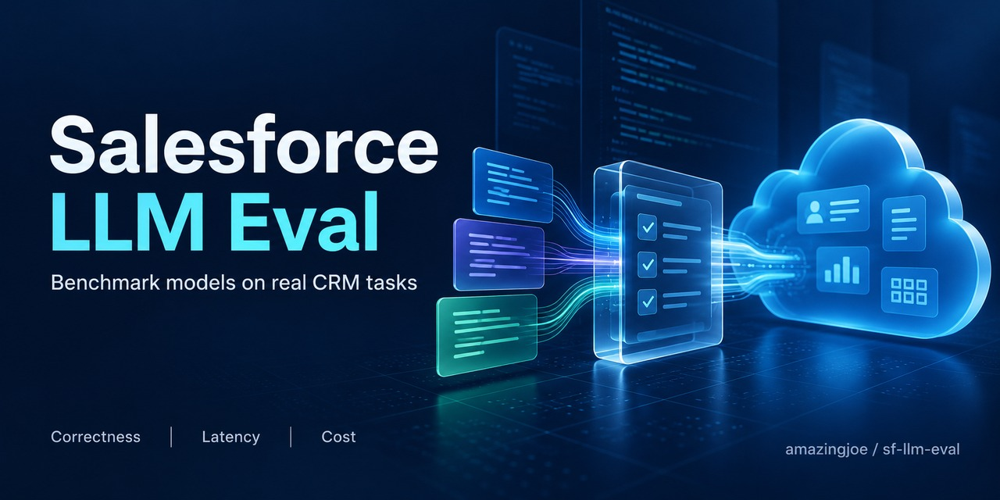
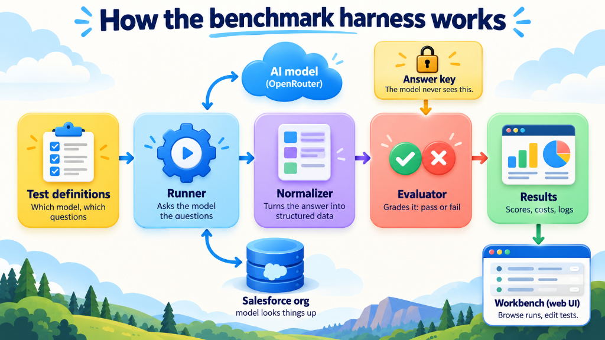
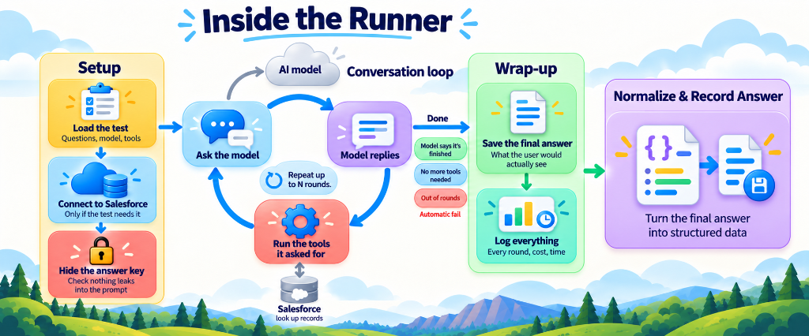
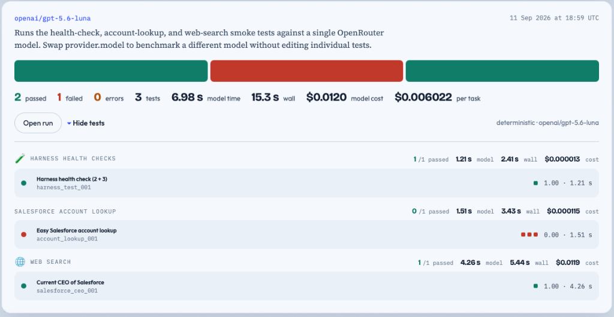
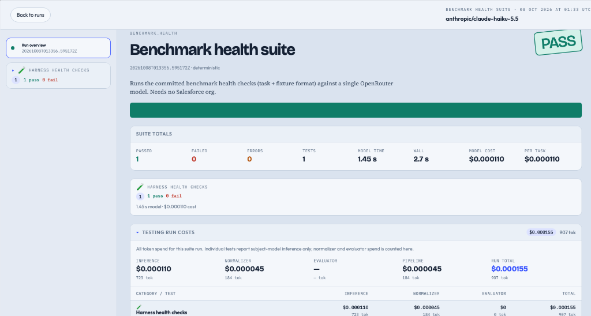

# Salesforce Open-Model Benchmark Harness



A Python benchmark harness for evaluating OpenRouter-hosted language models on Salesforce-oriented retrieval, schema comprehension, and reasoning tasks.

Tests are model-agnostic. A **test-set** (suite) selects which tasks to run and supplies the subject model and provider for the entire suite. Pipeline models (the JSON normalizer and future judge) are configured in a shared `config.yaml` so that every suite uses identical extraction standards.

---

## Prerequisites

Before running the harness, ensure you have the following installed and configured:

1. **Salesforce CLI (`sf`) — Required for Salesforce Operations**
   - The Salesforce CLI is **necessary for this harness to operate** when running Salesforce tasks or using Salesforce tools (`salesforce.query`, `salesforce.describe`, `salesforce.list_sobjects`, `salesforce.org_info`).
   - The harness executes local `sf` commands to authenticate, run SOQL queries, and discover metadata against your Salesforce orgs.
   - Install the official CLI from [Salesforce Developers](https://developer.salesforce.com/tools/salesforcecli).
   - Verify installation:
     ```bash
     sf --version
     ```
   - *(Note: Zero-dependency tasks, such as the arithmetic health check in `test-sets/benchmark_health.yaml`, do not require an active Salesforce org, but any Salesforce evaluation strictly requires `sf`.)*

2. **Python 3.10+**
   - Standard Python 3.10 or newer with `venv` and `pip`.

3. **OpenRouter API Key**
   - An API key from [OpenRouter](https://openrouter.ai/) for model inference and answer normalization.

---

## How the Benchmark Harness Works



### Inside the Runner Execution Loop



The runner (`runner.py`) orchestrates the end-to-end multi-turn conversation and tool execution lifecycle:

1. **Setup:** Loads the test configuration, initializes the Salesforce CLI session (if required), and verifies that answer keys from the fixture never leak into the model-visible prompt.
2. **Conversation Loop:** Dispatches the prompt to the AI model via OpenRouter, parses model responses, executes requested client tools (such as Salesforce SOQL queries and metadata discovery via the `sf` CLI), and returns observations to the model for up to `request.max_rounds`.
3. **Wrap-up:** Inference cleanly terminates when the model calls the finish signal (`benchmark.finish`), when no further tools are requested, or when `request.max_rounds` is reached (which marks an automatic failure without crashing). The user-facing answer is written to `answer.txt` and comprehensive logs/metrics are recorded.
4. **Normalize & Record Answer:** Passes the final answer to `normalizer.py` to extract structured JSON into `normalized.json` for deterministic evaluation.

## What It Does

1. **Loads Global Config:** Reads `config.yaml` for pipeline normalizer settings, evaluation modes, and Salesforce session configuration.
2. **Loads Suite Definition:** Reads a YAML test-set from `test-sets/` containing the subject model and categories of tasks.
3. **Validates Benchmark Tasks:** Enforces strict separation between model-visible tasks (`benchmarks/tasks/`) and evaluator answer keys (`benchmarks/fixtures/`), ensuring the prompt never reveals expected values.
4. **Bootstraps Salesforce Session:** If any selected task requires Salesforce tools, resolves the connected org alias via `sf`, displays org identity, prompts confirmation (or accepts `--yes`), and pins the session.
5. **Multi-Turn Inference Loop:** Sends prompts to OpenRouter, supporting both server tools (`web_search`) and local client tools (`salesforce.*`, `benchmark.finish`).
6. **Finish Signal & Stop Reasons:** Tracks explicit completion claims (`benchmark.finish`), handles token truncation, and gracefully fails on `max_rounds` without crashing.
7. **Comprehensive Logging:** Records exact request/response bodies, multi-round conversation transcripts (`transcript.txt`), client tool traces (`tool_trace.json`), and finish claims (`completion.json`).
8. **Structured Normalization:** Runs `normalizer.py` to extract raw model text into a well-defined JSON schema without repairing errors or leaking answer keys.
9. **Deterministic Evaluation:** Runs `evaluator.py` against fixture expectations, schema constraints, and configured tool-call limits (`tool_limits`).
10. **Delivery Diagnosis:** If an answer fails, automatically normalizes the full multi-round transcript to distinguish between facts that were never found (`not_found`) vs. facts that the model discovered in earlier rounds but lost in its final response (`found_not_delivered`).
11. **Cost & Metric Attribution:** Tracks subject model tokens/cost and pipeline normalizer tokens/cost separately.
12. **Suite Rollup:** Writes `summary.json` containing metrics, pass/fail status, stop reasons, self-assessment comparisons, and delivery diagnoses for every test.

---

## Setup

### 1. Clone & Create Virtual Environment

Choose the instructions for your operating system:

#### macOS / Linux

```bash
python3 -m venv .venv
source .venv/bin/activate
pip install -r requirements.txt
cp .env.example .env
```

#### Windows (PowerShell)

```powershell
python -m venv .venv
.venv\Scripts\Activate.ps1
pip install -r requirements.txt
Copy-Item .env.example .env
```

#### Windows (Command Prompt)

```cmd
python -m venv .venv
.venv\Scripts\activate.bat
pip install -r requirements.txt
copy .env.example .env
```

### 2. Configure Environment Variables

Edit your `.env` file and supply your OpenRouter key:

```text
openrouter_key=sk-or-v1-YOUR_REAL_OPENROUTER_KEY_HERE
```

Optional Salesforce session overrides in `.env`:
```text
SF_ORG_ALIAS=harness-org
# SF_EXPECTED_ORG_ID=00Dxxxxxxxxxxxx
```

### 3. Salesforce CLI Setup & Org Authentication

The Salesforce CLI (`sf`) is **required** for running benchmark tasks that interact with Salesforce data or metadata. Authenticate the org you wish to use with the alias configured in `config.yaml` (default: `harness-org`):

#### macOS / Linux & Windows

```bash
sf org login web --alias harness-org
```

Verify that the org is connected and view its details:

```bash
sf org display --target-org harness-org
```

> **Tip:** If you already have an authenticated org under a different alias, you can either update `salesforce.alias` in `config.yaml` or set `SF_ORG_ALIAS=<your-alias>` in `.env`.

### 4. Configure Subject and Normalizer Models

- **Subject Model (the entrant under test):** Set `provider.model` in `test-sets/benchmark_health.yaml` or `test-sets/harness_smoke.yaml`.
- **Normalizer Model (pipeline extractor):** Set `normalizer.model` in `config.yaml` (defaults to a high-capability extractor such as `openai/gpt-5.6-luna`).

---

## Architecture: Tasks, Fixtures, and Tests

The harness supports two task authoring formats:

### 1. Committed Benchmark Tasks (`benchmarks/tasks/` + `benchmarks/fixtures/`)

Official, version-controlled benchmarks separate the task from the answer key:

- **Task file (`benchmarks/tasks/<name>.yaml`):** Safe to show to the model. Contains the user prompt, permitted tools, tool call limits, normalizer schema, and `completion: required: true`. It contains **no expected answers or fixture values**.
- **Fixture file (`benchmarks/fixtures/<name>.yaml`):** Consumed exclusively by `evaluator.py`. Contains expected field values, accepted statuses, decline reasons, and validation operators.
- **Anti-Leak Validation:** The runner automatically rejects any benchmark task whose model-visible prompts or criteria contain answer values from its fixture.

### 2. Custom User Tests (`tests/*.yaml`)

Test definitions in `tests/*.yaml` are user-defined and intentionally ignored by Git. They use inline `pipeline.evaluator.checks` for rapid, ad-hoc experimentation with custom prompts or org-specific schemas without committing them to source control.

### Responsibility Matrix

| File / Directory | Scope & Ownership |
| --- | --- |
| `config.yaml` | Global normalizer model/provider, evaluator mode (`deterministic`), Salesforce CLI alias, metadata cache settings, and timeouts. |
| `test-sets/*.yaml` | Suite metadata, subject model (`provider.model`), and list of tasks to run (grouped by category). |
| `benchmarks/tasks/*.yaml` | Committed benchmark tasks visible to the model (prompt, success criteria, tools, schema, completion settings). |
| `benchmarks/fixtures/*.yaml` | Committed answer keys read only by the evaluator (checks, expected values, accepted statuses). |
| `tests/*.yaml` | User-defined, uncommitted test files with inline checks for local experiments (ignored by Git). |

---

## Commands & Usage

All commands below assume your virtual environment is activated (`.venv`).

### 1. Quick Verification: Health Check Suite

Run the arithmetic health check task (`benchmarks/tasks/harness_arithmetic_001.yaml`). This exercises the task/fixture split, finish signal, normalizer, and evaluator end-to-end without needing a Salesforce org:

#### macOS / Linux

```bash
python runner.py --suite test-sets/benchmark_health.yaml
```

#### Windows (PowerShell & Command Prompt)

```powershell
python runner.py --suite test-sets\benchmark_health.yaml
```

### 2. Full Suite Run (with Salesforce)

Runs every test in the suite through inference, normalization, and evaluation:

#### macOS / Linux

```bash
python runner.py --suite test-sets/harness_smoke.yaml --yes
```

#### Windows (PowerShell & Command Prompt)

```powershell
python runner.py --suite test-sets\harness_smoke.yaml --yes
```

*(The `--yes` flag skips the interactive Salesforce org confirmation prompt if the alias is already connected.)*

### 3. Filtered Suite Runs (Categories and Specific Tests)

You can filter by category with `--category` or by individual test id with `--only`. Both flags are repeatable:

#### macOS / Linux

```bash
# Run a specific category
python runner.py --suite test-sets/harness_smoke.yaml --category harness_health_check

# Run multiple categories
python runner.py --suite test-sets/harness_smoke.yaml \
  --category harness_health_check \
  --category web_search

# Run a single test by ID
python runner.py --suite test-sets/harness_smoke.yaml --only harness_test_001
```

#### Windows (PowerShell)

```powershell
# Run a specific category
python runner.py --suite test-sets\harness_smoke.yaml --category harness_health_check

# Run multiple categories (using backtick for multiline continuation)
python runner.py --suite test-sets\harness_smoke.yaml `
  --category harness_health_check `
  --category web_search

# Run a single test by ID
python runner.py --suite test-sets\harness_smoke.yaml --only harness_test_001
```

#### Windows (Command Prompt)

```cmd
:: Run a specific category
python runner.py --suite test-sets\harness_smoke.yaml --category harness_health_check

:: Run multiple categories (using caret for multiline continuation)
python runner.py --suite test-sets\harness_smoke.yaml ^
  --category harness_health_check ^
  --category web_search

:: Run a single test by ID
python runner.py --suite test-sets\harness_smoke.yaml --only harness_test_001
```

### 4. Inference Only (Skip Normalizer & Evaluator)

```bash
# macOS / Linux:
python runner.py --suite test-sets/harness_smoke.yaml --no-pipeline

# Windows:
python runner.py --suite test-sets\harness_smoke.yaml --no-pipeline
```

### 5. Manual Salesforce Schema-Cache Validation

Runs a 3-step sequence testing live seed caching, warm cache read, and forced cache refresh against `.salesforce_schema_cache/manual_validation/`:

```bash
# macOS / Linux:
python runner.py --suite test-sets/schema_cache_manual.yaml --no-pipeline --yes

# Windows:
python runner.py --suite test-sets\schema_cache_manual.yaml --no-pipeline --yes
```

### 6. Standalone Normalizer

Normalize an existing test run's final answer (`--source answer`, default) or full transcript (`--source transcript`):

#### macOS / Linux

```bash
python normalizer.py \
  --suite test-sets/harness_smoke.yaml \
  --test tests/acme_lookup.yaml \
  --run-dir runs/harness_smoke/<run-id>/salesforce_record_operations/acme_lookup_001
```

#### Windows (PowerShell & Command Prompt)

```cmd
python normalizer.py --suite test-sets\harness_smoke.yaml --test tests\acme_lookup.yaml --run-dir runs\harness_smoke\<run-id>\salesforce_record_operations\acme_lookup_001
```

### 7. Standalone Evaluator

Evaluate a normalized run deterministically, or update delivery diagnosis (`--delivery`):

#### macOS / Linux

```bash
python evaluator.py \
  --suite test-sets/harness_smoke.yaml \
  --test tests/acme_lookup.yaml \
  --run-dir runs/harness_smoke/<run-id>/salesforce_record_operations/acme_lookup_001
```

#### Windows (PowerShell & Command Prompt)

```cmd
python evaluator.py --suite test-sets\harness_smoke.yaml --test tests\acme_lookup.yaml --run-dir runs\harness_smoke\<run-id>\salesforce_record_operations\acme_lookup_001
```

### 8. Web Workbench & Visualizer

Launch the local interactive visualizer UI to view run results, execution traces, costs, and edit benchmark tasks/fixtures:

#### macOS / Linux

```bash
python visualizer/serve.py
```

#### Windows (PowerShell & Command Prompt)

```cmd
python visualizer\serve.py
```

Open your browser to `http://127.0.0.1:8765`.

Optional flags:
```bash
python visualizer/serve.py --host 127.0.0.1 --port 8765 --runs runs
```

#### Suite Runs Overview



The runs overview displays benchmark runs at a glance, highlighting pass/fail ratios, model vs. wall time, total model cost, and cost per task. Individual tests can be expanded to inspect category breakdowns and pass/fail indicators.

#### Run Detail & Cost Breakdown



Selecting an individual run provides detailed suite totals, status badges, and a dedicated **Testing Run Costs** panel separating subject-model inference spend from pipeline normalizer spend across all categories.

### 9. Running Unit Tests

Run the full test suite (covers Salesforce CLI integration, tool runtime, schema caching, task/fixture loading, finish signal, and evaluator grading):

#### macOS / Linux & Windows

```bash
python -m unittest discover -s unit_tests -v
```

---

## Grading, Signals, and Diagnostics

Every benchmark test records four key evaluative dimensions:

### 1. Pass / Fail (Correctness)
Scored strictly against the model's final response (`answer.txt`). Facts discovered earlier in the conversation do not count as a pass if they are omitted from the final answer.

### 2. Stop Reason
Records how inference ended:
- `completed`: The model ended normally with a non-empty final answer.
- `empty_final`: The final message had no text.
- `max_tokens`: The provider cut off the final message at the token limit.
- `max_rounds`: The run reached `request.max_rounds` with pending tool calls. **This fails the test gracefully in the evaluator without crashing the harness.**

### 3. Self-Assessment & Finish Signal (`benchmark.finish`)
When `completion.required: true` is configured, the harness advertises the `benchmark.finish` client tool. The model is instructed to call this tool in the same turn as its final answer with:
- `status`: `answered`, `not_found`, or `declined`
- `note`: Short private benchmark remark (never treated as part of the user answer)

The evaluator compares the claimed status with fixture expectations:
- `match`: The claimed status matched the fixture and the answer passed.
- `false_success`: The claimed status matched the fixture, but the answer failed correctness checks.
- `wrong_status`: The claimed status contradicted the fixture's expected status.
- `missing`: The finish tool was offered but never called.

### 4. Delivery Diagnosis
When a test fails, the harness automatically performs a transcript delivery pass:
- `delivered`: The test passed (correct facts were in the final answer).
- `found_not_delivered`: The correct facts were present earlier in the run's transcript (`transcript.txt`), but the model failed to convey them in its final answer.
- `not_found`: The correct facts appeared nowhere in the run transcript.

### 5. Tool Call Limits & Counts
Client tool calls are counted per tool and recorded in `tool_trace.json` and `evaluation.json`. Tasks can specify strict limits in YAML:
```yaml
tool_limits:
  salesforce.query:
    max_calls: 2
```
Exceeding the configured limit fails the test deterministically.

### 6. Cost & Token Accounting
Subject model tokens/cost and pipeline normalizer tokens/cost are tracked and reported separately in `summary.json`. Normalizer costs are never attributed to the subject model.

---

## Run Artifacts

Suite runs are written to `runs/<suite-id>/<timestamp>/`:

```text
runs/<suite-id>/<timestamp>/
├── suite.yaml                     # Suite definition snapshot
├── config.yaml                    # Global config snapshot
├── resolved_suite_redacted.yaml   # Environment-resolved suite (secrets redacted)
├── resolved_config_redacted.yaml  # Environment-resolved config (secrets redacted)
├── salesforce_session.json        # Org session metadata (no access tokens)
├── summary.json                   # Suite rollup: pass/fail, costs, stop reasons, self-assessment
└── <category>/<test-id>/
    ├── source.json                # Task hash, fixture hash, model slug, sf version
    ├── test.yaml                  # Model-visible test YAML
    ├── request.json               # Initial request body sent to OpenRouter
    ├── response.json              # Final assistant response
    ├── answer.txt                 # Extracted final assistant answer
    ├── transcript.txt             # Full text of every assistant turn
    ├── completion.json            # benchmark.finish signal status, note, and round index
    ├── tool_trace.json            # Client and server tool execution history and stop reason
    ├── metrics.json               # Latency, token usage, subject model cost
    ├── rounds/                    # Multi-turn round details (requests, responses, tool results)
    │   └── 00/
    │       ├── request.json
    │       ├── response.json
    │       └── tool_results.json
    ├── normalizer_request.json    # Payload sent to normalizer model
    ├── normalizer_response.json   # Raw normalizer response
    ├── normalizer_metrics.json    # Normalizer latency, tokens, cost
    ├── normalized.json            # Structured JSON extracted from answer.txt
    ├── normalized_transcript.json # Structured JSON extracted during delivery pass (if run)
    └── evaluation.json            # Deterministic evaluation report, check details, delivery label
```

---

## Tools Reference

### Server Tools (OpenRouter executed)

- `web_search`: Translated to OpenRouter's server-side web search plugin (`{ "type": "openrouter:web_search" }`).

### Client Tools (Harness executed)

The harness handles client function execution locally:

| YAML Shorthand | Function Name | Underlying CLI Command / Action |
| --- | --- | --- |
| `benchmark.finish` | `benchmark_finish` | Records outcome claim (`answered`, `not_found`, `declined`) and terminates run. |
| `salesforce.query` | `salesforce_query` | Executes `sf data query --query <SOQL> --json`. |
| `salesforce.describe` | `salesforce_describe` | Executes `sf sobject describe --sobject <name> --json` with schema slimming. |
| `salesforce.list_sobjects` | `salesforce_list_sobjects` | Executes `sf sobject list --category <all\|standard\|custom> --json`. |
| `salesforce.org_info` | `salesforce_org_info` | Returns org identity from `sf org display --json`. |

### Salesforce CLI Session & Metadata Caching

- **Locked Target Org:** The harness binds `--target-org <alias>` to all CLI calls. The model and test prompts cannot change or redirect the org.
- **Safety Restrictions:** Only single `SELECT` SOQL queries are permitted. Data mutations, Apex execution, and metadata deployments are strictly blocked.
- **Metadata Caching:** Both `salesforce.describe` and `salesforce.list_sobjects` cache results locally in `.salesforce_schema_cache/` (scoped by org and user id, valid for 48 hours by default) to minimize latency and API usage. Models can pass `refresh: true` to force live fetches.
